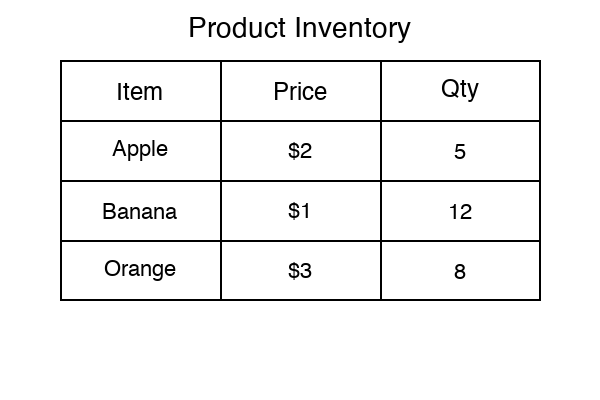
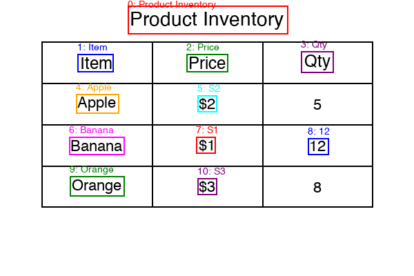
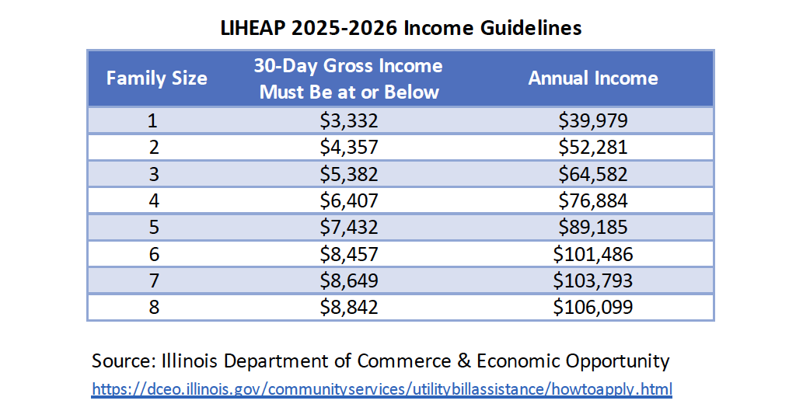
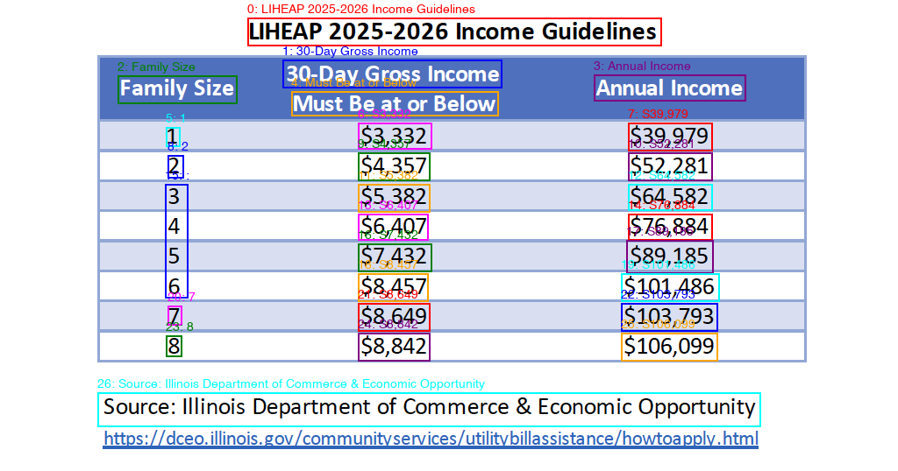
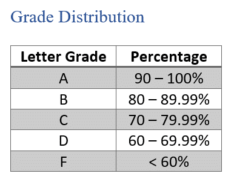
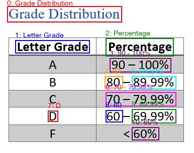
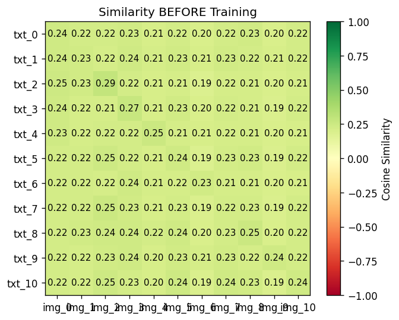
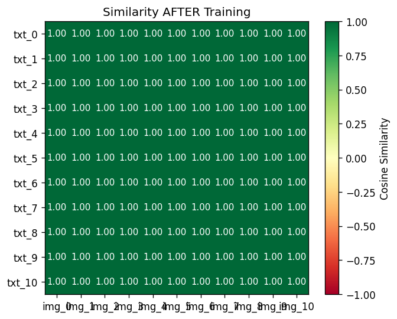
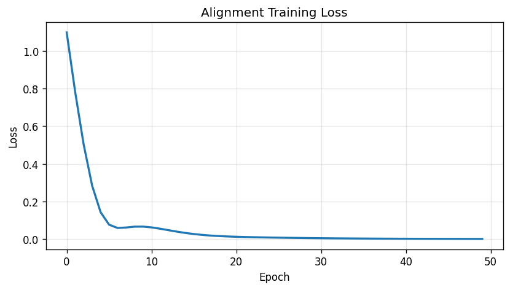

# Table-Text Alignment for VLMs

**Cell-level contrastive alignment loss that forces VLMs to align their visual representations of table regions with OCR-extracted text — giving the model semantic anchors for every cell.**

---

## How It Works

```
Step 1 — OCR: Find every cell in the table image (using EasyOCR)
┌─────────────────────────────────────────────────┐
│  Table Image                                    │
│       │                                         │
│       ▼                                         │
│  bb_and_text_from_table_image()                 │
│       │                                         │
│       ├──► bounding boxes  (where each cell is) │
│       └──► OCR text        (what each cell says)│
└─────────────────────────────────────────────────┘

Step 2 — Embed: Convert each cell into a vector the model understands
┌─────────────────────────────────────────────────┐
│  bounding boxes ──► bb_to_image_embeddings()    │
│                     (extract what the VLM        │
│                      "sees" in that region)      │
│                                                  │
│  OCR text ────────► get_text_embedding()         │
│                     (extract what the VLM        │
│                      "understands" from the text)│
└──────────────────────────────────────────────────┘

Step 3 — Align: Train the model so the two match up
┌──────────────────────────────────────────────────┐
│  For each cell:                                  │
│    compare image embedding vs text embedding     │
│    using cosine similarity                       │
│                                                  │
│  alignment_loss = how far apart they are         │
│  total_loss = task_loss + w * alignment_loss     │
│                                                  │
│  Backpropagate → model learns to connect what    │
│  it sees in a cell with what the text says       │
└──────────────────────────────────────────────────┘
```

---

## Step 1: OCR Detection — `bb_and_text_from_table_image()`

Implemented in `src/ocr_utils.py`. Takes any table image, detects every text region using EasyOCR, and returns bounding boxes `(x1, y1, x2, y2)` paired with the OCR'd text string for each cell. This is the first piece of the pipeline — referred to as `bb_and_text_from_table_image()` in Sameen's pseudocode.

### Synthetic table

```bash
python -m src.ocr_utils
```

**Input** — a generated table with known content:



**Output** — every cell detected, labeled with its index and extracted text:



11 detections. All headers (Item, Price, Qty), row labels (Apple, Banana, Orange), and values found.

### Real-world tables

Also tested on real table images downloaded from the internet to verify the function works beyond synthetic data.

```bash
python -m src.ocr_utils test_images/income_guidelines.png
```





27 detections — headers, row numbers, and dollar amounts all found. One OCR quirk: EasyOCR reads "$" as "S" (e.g. "$3,332" → "S3,332"). This is a known EasyOCR limitation with dollar sign characters.

```bash
python -m src.ocr_utils test_images/grade_distribution.png
```





11 detections on a clean simple table.

---

## Step 2: CLIP Prototype — Validating the Alignment Idea

### Why build this?

The real pipeline will use Qwen3-VL (a large model that requires GPU infrastructure and integration with Sameen's codebase). Before going through all of that, a quick prototype was built using [CLIP](https://openai.com/research/clip) (a smaller, easy-to-run image-text model by OpenAI) to answer a simple question: **can a model be trained to match a table cell's image with its text?** If the answer is no, there's no point setting up Qwen3-VL.

### What CLIP does here

CLIP can convert both images and text into numerical vectors (embeddings). So for each cell detected by the OCR in Step 1, two embeddings are produced:
- **Image embedding** — crop the cell region from the table image, pass it through CLIP
- **Text embedding** — take the OCR text string (e.g. "Apple"), pass it through CLIP

Now both the image and the text are represented as numbers, and cosine similarity can be used to measure how "close" they are.

### The problem

Out of the box, CLIP scores every image-text pair at roughly ~0.22. It can't tell that the image crop of "Apple" should match the text "Apple" any more than it matches "Banana." This makes sense — CLIP was trained on photos and captions, not tiny crops of table cells.

### The fix

Two small trainable layers (projection heads) were added on top of the frozen CLIP embeddings and trained with a simple rule: **the image of cell N should match the text of cell N, and not match anything else.** After ~20 rounds of training, matched pairs hit 0.999 similarity.

### Results

**Before training** — everything looks the same (~0.22), the model can't distinguish any pairs:



**After training** — matched pairs (the diagonal) are now clearly aligned:



**Training loss:**



| Metric | Before | After |
|--------|--------|-------|
| Matched-pair similarity | 0.24 | 0.999 |
| Retrieval accuracy (image→text) | 55% | 73% |
| Retrieval accuracy (text→image) | 64% | 82% |
| Loss | 1.10 | 0.001 |

### Conclusion

The alignment concept is validated — a model **can** be trained to connect table cell images with their corresponding text. This prototype is not the final approach though. CLIP uses two separate encoders for images and text, which is why projection heads were needed to bridge them. Qwen3-VL (the real model, from Sameen's [codebase](https://github.com/Patchwork53/VLMs-Need-Words-Public/blob/main/shape_correspond/rep_qwen_squiggles.py)) is a single model where images and text already share the same internal representation space — so the alignment loss can be applied directly without needing extra projection heads.

Implemented in `src/embedding_utils.py`, `src/losses.py`, `src/train.py`, and `src/demo.py`.

---

## Setup

```bash
git clone <this-repo>
cd SeniorResearchProject
python -m venv venv
source venv/bin/activate
pip install -r requirements.txt
```

## Run

```bash
# OCR on synthetic table
python -m src.ocr_utils

# OCR on a real image
python -m src.ocr_utils path/to/table.png

# Full prototype pipeline (OCR → CLIP embeddings → alignment training)
python -m src.demo --epochs 50

# Tests (6 OCR tests + embedding/loss/training tests)
python -m pytest tests/ -v -s
```

## Project Structure

```
src/
├── ocr_utils.py          # bb_and_text_from_table_image() — OCR function (Step 1)
├── synthetic_data.py     # Generates sample table images for testing
├── embedding_utils.py    # CLIP embedding extraction (Step 2 prototype)
├── losses.py             # Alignment loss functions (Step 2 prototype)
├── train.py              # Projection head training loop (Step 2 prototype)
└── demo.py               # End-to-end demo tying Steps 1 + 2 together

tests/
├── test_ocr.py           # OCR detection tests
├── test_embeddings.py    # Embedding extraction tests
├── test_loss.py          # Loss computation tests
└── test_train.py         # Training loop tests
```

Sameen's `bb_to_image_embeddings` using Qwen3-VL is in [his repo](https://github.com/Patchwork53/VLMs-Need-Words-Public/blob/main/shape_correspond/rep_qwen_squiggles.py). The next step is integrating the OCR function from this repo with his pipeline.

## Progress

**Done:**
- [x] Implemented `bb_and_text_from_table_image()` — tested on synthetic + real-world images
- [x] Studied Sameen's `bb_to_image_embeddings()` — [reference code](https://github.com/Patchwork53/VLMs-Need-Words-Public/blob/main/shape_correspond/rep_qwen_squiggles.py) that extracts Qwen3-VL hidden states for bounding box regions
- [x] Built CLIP-based proof-of-concept — standalone prototype proving alignment training works end-to-end

**Next:**
- [ ] `get_text_embedding()` — extract contextualized hidden states from Qwen3-VL's LLM backbone at mid-layers (8-16), informed by [LatentLens](https://arxiv.org/abs/2602.00462)
- [ ] Integrate OCR function into Sameen's Qwen3-VL pipeline
- [ ] Evaluation on real table datasets (PubTabNet)

## References

- [VLMs Need Words](https://arxiv.org/abs/2604.02486) — Shahgir et al. Why VLMs fail on unnamed visual entities
- [LatentLens](https://arxiv.org/abs/2602.00462) — Krojer et al. Mid-layer hidden states as shared text-image spaces
- [bb_to_image_embeddings reference code](https://github.com/Patchwork53/VLMs-Need-Words-Public/blob/main/shape_correspond/rep_qwen_squiggles.py)
