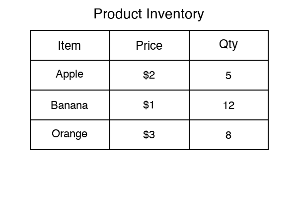
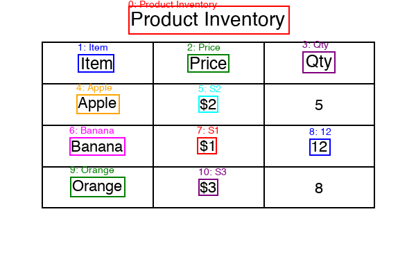
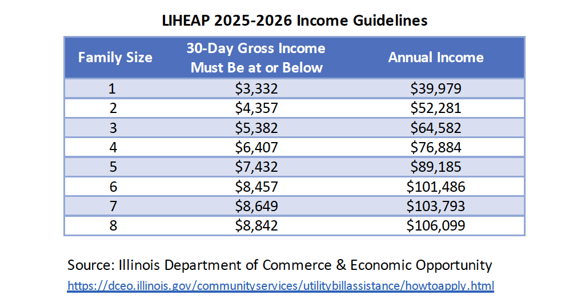
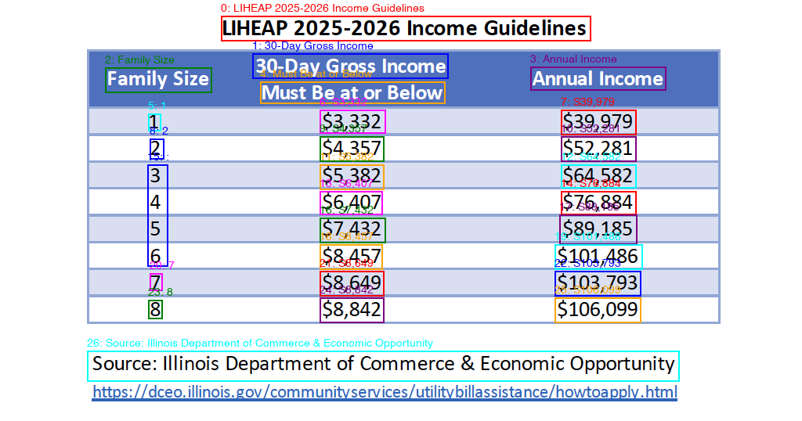
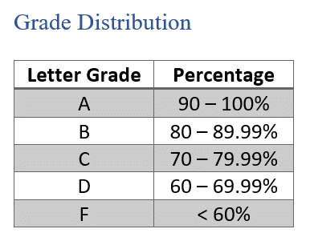
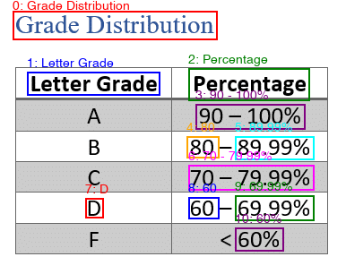
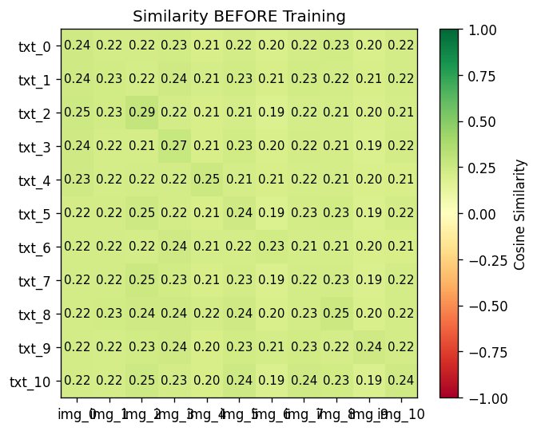
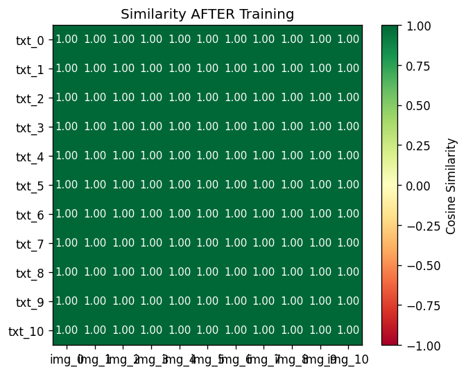
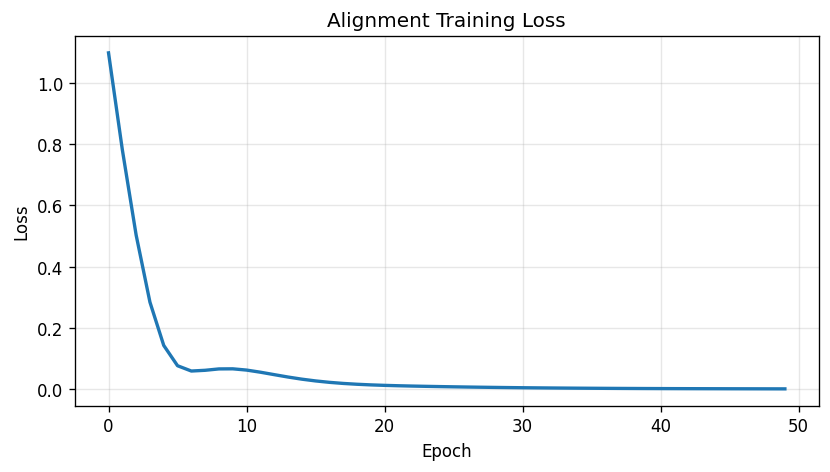

# Cell-Level Table-Text Alignment for Vision-Language Models

**Senior Research Project (CS297) — Rushi Patel, University of California, Riverside**

An auxiliary training objective that pushes a vision-language model's internal visual representations of table cells toward their corresponding OCR text, giving the model explicit semantic anchors for every cell in a table image.

## Motivation

Vision-language models (VLMs) like Qwen3-VL can answer questions about table images, but their internal representations of individual table cells are not explicitly tied to the textual content those cells contain. Recent work on intermediate-layer representations — particularly LatentLens (Krojer et al., 2024) and VLMs Need Words (Shahgir et al., 2025) — suggests that VLM hidden states at mid-to-late transformer layers occupy a shared text-image embedding space that can be probed through the model's own language model head.

This project investigates whether **forcing** that alignment via an auxiliary loss during fine-tuning improves downstream table question-answering performance. The core hypothesis: if the model's visual tokens for a cell region are trained to be linguistically decodable (i.e., the frozen LM head can recover the OCR text from the visual hidden states), the model should better understand table structure and content.

## Key Finding

> **The alignment objective is learnable but does not improve downstream task performance.** Training with a frozen-LM-head bag-of-words probe loss at layer 26 of Qwen3-VL-2B-Instruct reduces the alignment NLL from 10.68 to 6.03 (well below the random floor of 11.93), confirming that the model's visual representations can be pushed toward linguistic decodability. However, exact-match accuracy on CoSyn-400K table QA remains at 0.485 vs. 0.495 for the task-only baseline — within statistical noise (σ ≈ 0.035 at n=200). The downstream task can be solved through a pathway that does not require intermediate visual representations to be linguistically structured.

---

## Table of Contents

- [Pipeline Overview](#pipeline-overview)
- [Step 1: OCR Detection](#step-1-ocr-detection)
- [Step 2: CLIP Prototype — Validating the Alignment Concept](#step-2-clip-prototype--validating-the-alignment-concept)
- [Step 3: Qwen3-VL Alignment — Full Implementation and Results](#step-3-qwen3-vl-alignment--full-implementation-and-results)
  - [Data Preprocessing](#data-preprocessing)
  - [Training Setup](#training-setup)
  - [Alignment Loss Formulations](#alignment-loss-formulations)
  - [Layer Selection](#layer-selection)
  - [Training Runs and Results](#training-runs-and-results)
  - [Analysis](#analysis)
- [Setup and Usage](#setup-and-usage)
- [Project Structure](#project-structure)
- [References](#references)

---

## Pipeline Overview

The system operates in three stages:

```
Stage 1 — OCR Detection
┌──────────────────────────────────────────────────────┐
│  Table Image                                         │
│       │                                              │
│       ▼                                              │
│  bb_and_text_from_table_image()   [EasyOCR]          │
│       │                                              │
│       ├──► bounding boxes  (x1, y1, x2, y2 per cell) │
│       └──► OCR text        (string content per cell)  │
└──────────────────────────────────────────────────────┘

Stage 2 — Embedding Extraction
┌──────────────────────────────────────────────────────┐
│  bounding boxes ──► bb_to_image_embeddings()          │
│                     Maps each bbox to the VLM's       │
│                     visual token indices, then         │
│                     extracts hidden states at a        │
│                     target layer via forward hook      │
│                                                       │
│  OCR text ────────► Text hidden states                │
│                     Run each cell's OCR text through   │
│                     the VLM's language model (no       │
│                     image) to get the reference         │
│                     representation at the same layer    │
└───────────────────────────────────────────────────────┘

Stage 3 — Alignment Training
┌───────────────────────────────────────────────────────┐
│  For each cell in the image:                           │
│    visual_repr  = mean-pool visual tokens in the bbox  │
│    text_repr    = precomputed text hidden state         │
│                                                        │
│  alignment_loss = distance(visual_repr, text_repr)     │
│  total_loss     = task_loss + w × alignment_loss        │
│                                                        │
│  Backpropagate through the LM layers only              │
│  (vision encoder + MLP projector stay frozen)           │
└────────────────────────────────────────────────────────┘
```

---

## Step 1: OCR Detection

**Implementation:** `src/ocr_utils.py`

The function `bb_and_text_from_table_image()` takes a table image and returns bounding boxes paired with OCR text for every detected cell. It uses [EasyOCR](https://github.com/JaidedAI/EasyOCR) for text detection and recognition.

### Validation on Synthetic Data

A controlled synthetic table with known content was used to verify detection accuracy:

```bash
python -m src.ocr_utils
```

**Input** — generated table with known ground-truth content:



**Output** — all cells detected and labeled with extracted text:



11 detections — all headers (Item, Price, Qty), row labels (Apple, Banana, Orange), and numeric values correctly identified.

### Validation on Real-World Tables

The OCR pipeline was tested on real table images to confirm generalization beyond synthetic data.

```bash
python -m src.ocr_utils test_images/income_guidelines.png
```





27 detections — headers, row numbers, and dollar amounts all found. One known EasyOCR limitation: the "$" character is sometimes misread as "S" (e.g., "$3,332" → "S3,332").

```bash
python -m src.ocr_utils test_images/grade_distribution.png
```





11 detections on a clean table layout.

---

## Step 2: CLIP Prototype — Validating the Alignment Concept

**Implementation:** `src/embedding_utils.py`, `src/losses.py`, `src/train.py`, `src/demo.py`

### Purpose

Before building the full Qwen3-VL pipeline (which requires GPU infrastructure and complex integration), a lightweight prototype was built using [CLIP](https://openai.com/research/clip) (Radford et al., 2021) to answer a fundamental question: **can a model be trained to align a table cell's visual representation with its textual content?** If this fails even with CLIP, the approach is unlikely to work with any VLM.

### Method

CLIP produces embeddings for both images and text. For each cell detected by OCR:
- **Image embedding**: crop the cell region from the table image, encode with CLIP's vision encoder
- **Text embedding**: encode the OCR text string with CLIP's text encoder

Two small trainable projection heads were added on top of the frozen CLIP embeddings and trained with a contrastive objective: the image embedding of cell N should be similar to the text embedding of cell N and dissimilar to all other cells.

### Results

**Before training** — cosine similarity is ~0.22 for all pairs; the model cannot distinguish matched from unmatched:



**After training** (~20 epochs) — matched pairs on the diagonal are clearly separated:



**Training loss convergence:**



| Metric | Before | After |
|--------|--------|-------|
| Matched-pair cosine similarity | 0.24 | 0.999 |
| Image → text retrieval accuracy | 55% | 73% |
| Text → image retrieval accuracy | 64% | 82% |
| Contrastive loss | 1.10 | 0.001 |

### Takeaway

The alignment concept is validated: a model **can** learn to match table cell images with their text. The CLIP prototype required projection heads because CLIP uses separate encoders for vision and text. In contrast, Qwen3-VL is a unified model where images and text share the same transformer layers, so the alignment loss can be applied directly to intermediate hidden states without additional projection layers.

---

## Step 3: Qwen3-VL Alignment — Full Implementation and Results

With the CLIP prototype confirming the alignment idea is feasible, the full pipeline was built on **Qwen3-VL-2B-Instruct** using the table split of **CoSyn-400K** (a synthetic table question-answering dataset).

### Data Preprocessing

**Implementation:** `src/preprocess_cosyn.py`

For each CoSyn-table image, the preprocessing pipeline:
1. Runs EasyOCR to extract bounding boxes and OCR text for every cell
2. Passes each cell's OCR text through the Qwen3-VL language model (text-only, no image input) to extract hidden states at all 28 LM layers
3. Saves bounding boxes, OCR text, per-layer text hidden states, and an image hash to `data/preprocessed/{idx}.pt`

These `.pt` files serve as alignment targets during training. For each cell visible in a table image, the training loop knows: which pixel region it occupies, what text it contains, and what the model's text-only representation of that text looks like at every layer. This is run once on GPU before training begins. The current experiments use 1,050 preprocessed images.

### Training Setup

**Implementation:** `src/train_qwen_cosyn.py`

The training configuration:
- **Frozen components:** Vision encoder and MLP projector (only the 28 LM layers are trainable)
- **Task objective:** Next-token cross-entropy loss on table QA answer generation
- **Auxiliary objective:** Alignment loss applied at a single intermediate LM layer via a PyTorch forward hook
- **Combined loss:** `loss = task_loss + alignment_loss_weight × alignment_loss`
- **Optimizer:** AdamW with cosine learning rate schedule
- **Infrastructure:** Single-GPU training with Hugging Face Accelerate, gradient accumulation (8 steps), mixed precision (bf16)

The vision encoder is frozen because the research question is about the LM layers' internal representations — whether training them to be linguistically decodable at intermediate layers helps downstream performance. Freezing the vision encoder isolates this effect.

### Alignment Loss Formulations

**Implementation:** `src/losses.py`

Two alignment loss formulations were implemented and tested:

**1. MSE (Mean Squared Error)**
- Mean-pool the visual tokens within each cell's bounding box at layer L
- Compare against the precomputed text hidden state at the same layer using L2 distance
- Simple and direct, but operates in the raw hidden-state space where distances may not be semantically meaningful

**2. LM Head Bag-of-Words (`lm_head_bow`)**
- Mean-pool the visual tokens within each cell's bounding box at layer L
- Project the pooled representation through the model's **frozen** language model head (the same linear layer used for next-token prediction)
- Compute cross-entropy loss against the OCR tokens of that cell (treated as a bag of words — order-independent)
- Inspired by the LatentLens and VLMs Need Words findings: if intermediate hidden states occupy a shared text-image space, the frozen LM head should be able to decode them into text. This loss directly trains for that property.

The `lm_head_bow` formulation has a clear interpretability advantage: the alignment NLL can be compared against the random baseline (`log(vocab_size) = log(151643) ≈ 11.93` nats) to measure whether the loss is doing anything meaningful.

### Layer Selection

**Implementation:** `scripts/calibrate_alignment.py`

The `lm_head_bow` loss assumes some LM layers already encode visual information in a partially text-decodable format. A layer sweep was conducted on 20 CoSyn-table samples (~191 cells) to measure the per-cell NLL at each layer using the **untrained** model:

| Layer | Mean NLL | Min NLL | Δ vs. Random (11.93) |
|------:|---------:|--------:|---------------------:|
| 8     | 14.94    | 9.08    | +3.01                |
| 12    | 13.09    | 7.43    | +1.16                |
| 16    | 12.23    | 5.68    | +0.30                |
| 20    | 12.59    | 7.84    | +0.66                |
| 24    | 11.62    | 5.94    | −0.31                |
| **26**| **10.54**| **4.55**| **−1.39**            |
| 27    | 32.60    | 2.23    | +20.67               |

**Layer 26** was selected as the alignment target. It is the only layer where the frozen LM head can decode visual representations meaningfully below the random floor — the untrained model already achieves a mean NLL of 10.54 (1.39 nats below random). This means the LM head can partially read the visual hidden states at this layer even without any alignment training, making it a natural anchor point for the auxiliary loss.

Layers 8–20 start at or above the random baseline, meaning the LM head cannot decode visual reps at all — attaching the alignment loss there would require the model to learn the alignment entirely from scratch. Layer 27 is anomalous: the final layer's hidden states encode next-token predictions rather than cell content, producing artificially low NLL on coincidental token matches.

### Training Runs and Results

**Evaluation:** `scripts/eval_table_metrics.py` — 200-item held-out set, exact-match (EM) against gold answers and token-level F1.

| Run | Configuration | Alignment Weight | Layer | Train Items |
|-----|--------------|----------------:|------:|------------:|
| Base | Zero-shot Qwen3-VL-2B-Instruct (no fine-tuning) | — | — | — |
| Run 1 | Task + MSE alignment | 1e-5 | 16 | ~416K |
| Run 2 | Task-only (no alignment) | 0 | — | ~416K |
| Run 4 | Task + `lm_head_bow` alignment | 0.04 | 26 | 9,330 |

**Note on Run 4's training set:** Only 1,050 of the ~416K training items have preprocessed alignment data (~0.25%). Without filtering, ~98% of mini-batches contribute zero alignment gradient. The `--aligned_only` flag restricts training to the 9,330 items that have alignment targets (each image appears in multiple QA pairs), ensuring every batch contributes alignment signal. The held-out evaluation set is unfiltered, so EM scores are comparable across all runs.

#### Results

| Run | EM (n=200) | Token F1 (n=200) |
|-----|----------:|----------------:|
| Base (zero-shot) | 0.000 | 0.051 |
| Run 1 (task + MSE, w=1e-5, layer 16) | 0.500 | 0.586 |
| Run 2 (task-only baseline) | 0.495 | 0.584 |
| **Run 4 (task + lm_head_bow, w=0.04, layer 26)** | **0.485** | **0.573** |

#### Alignment Loss Trajectory (Run 4)

The alignment loss dropped from 10.68 → 6.03 over 2 epochs, confirming the objective is learnable — the model's layer-26 visual representations moved ~4.7 nats below the random floor, meaning the frozen LM head can decode cell content from visual hidden states significantly better than chance after training.

### Analysis

**The alignment objective is achievable but orthogonal to the downstream task.** The −0.015 EM gap between Run 4 (0.485) and Run 1 (0.500) is well within one standard deviation (σ ≈ 0.035 at n=200). All three fine-tuned runs — with MSE alignment, with LM-head alignment, and without any alignment — perform comparably.

This is a meaningful negative result: it demonstrates that Qwen3-VL-2B can solve CoSyn table QA through an internal pathway that does **not** require intermediate visual representations to be linguistically decodable. Forcing them to be decodable (which the model can learn to do) neither helps nor significantly hurts. **Learnable ≠ useful.**

#### Confounds and Candidate Next Steps

Two confounds should be addressed before drawing stronger conclusions:

1. **Dataset size imbalance.** Run 4 trained on 9,330 unique items (with `--aligned_only`) while Run 2 trained on ~416K items. A controlled comparison (Run 5 = task-only on the same 9,330 items) would isolate whether the EM difference is due to the alignment loss or the smaller training set.

2. **Layer selection optimized for the probe, not the task.** Layer 26 was chosen because the frozen LM head can already decode visual reps there. But this also means those representations are already mostly linguistic — the alignment loss may be reinforcing something the model already does. An earlier layer (e.g., 20–22), where the visual-to-linguistic transition is still in progress, might be more impactful for downstream EM even though the frozen probe is noisier there.

3. **Alignment data coverage.** Expanding from 1,050 to 10,000+ preprocessed images would allow training without the `--aligned_only` filter, maintaining full-data fidelity while still providing alignment signal.

### Engineering Notes

- **Run 3 failure (silent death):** A single-GPU `lm_head_bow` run at layer 16 died silently after 12 hours because stdout was block-buffered through a bash redirect, and the final traceback never reached disk. Fixed by enforcing `PYTHONUNBUFFERED=1` + `python -u` + piping through `tee` in the launch script.
- **Loss-logging bug:** The original loss accumulation logic divided by `log_every` (which counts optimizer steps) but accumulated per micro-batch, producing values 8× the true per-forward mean at `grad_accum_steps=8`. Fixed; older run logs (pre-fix) need manual rescaling.
- **Multi-GPU OOM:** Dataset construction reproducibly OOMs with `--num_processes ≥ 2` during the QA-pair expansion phase. All runs used single-GPU training.
- **Checkpoint and recovery:** Mid-epoch checkpointing via `accelerator.save_state`, `--resume_from` flag, and a process watchdog (`scripts/watchdog.sh`) were validated end-to-end with a deliberate SIGTERM + resume cycle. Training continues at the saved step with loss continuity.

---

## Setup and Usage

### Prerequisites

- Python 3.10+
- CUDA-capable GPU (required for Qwen3-VL training; CLIP prototype runs on CPU)
- ~10 GB disk space for model weights and preprocessed data

### Installation

```bash
git clone https://github.com/rpatel0022/SeniorResearchProject.git
cd SeniorResearchProject
python -m venv venv
source venv/bin/activate
pip install -r requirements.txt
```

### Running the OCR Pipeline

```bash
# OCR on the built-in synthetic table
python -m src.ocr_utils

# OCR on any table image
python -m src.ocr_utils path/to/table.png
```

### Running the CLIP Prototype

```bash
# Full prototype pipeline: OCR → CLIP embeddings → contrastive alignment training
python -m src.demo --epochs 50
```

### Running the Qwen3-VL Pipeline

```bash
# Step 1: Preprocess CoSyn-400K table images (run once on GPU)
python -m src.preprocess_cosyn

# Step 2: Train with alignment loss
bash scripts/launch_align.sh

# Step 3: Evaluate on held-out set
python scripts/eval_table_metrics.py --checkpoint_dir <path>
```

### Running Tests

```bash
# Full test suite (OCR, embeddings, loss functions, training loop)
python -m pytest tests/ -v -s
```

---

## Project Structure

```
src/
├── ocr_utils.py            # bb_and_text_from_table_image() — EasyOCR cell detection
├── synthetic_data.py        # Generates sample table images for testing
├── embedding_utils.py       # CLIP embedding extraction (prototype)
├── losses.py                # Alignment losses: cosine, contrastive, MSE, lm_head_bow
├── train.py                 # CLIP projection head training loop (prototype)
├── demo.py                  # End-to-end CLIP prototype demo
├── preprocess_cosyn.py      # CoSyn-400K → per-image bboxes, OCR text, layer-wise hidden states
├── token_map.py             # OCR bounding box → Qwen3-VL visual token index mapping
└── train_qwen_cosyn.py      # Qwen3-VL fine-tuning with auxiliary alignment loss

scripts/
├── calibrate_alignment.py   # Layer sweep + alignment weight calibration
├── eval_table_metrics.py    # EM / token-F1 evaluation on held-out split
├── launch_align.sh          # Launch wrapper (unbuffered IO, nohup, tee)
└── watchdog.sh              # Process + log-staleness watchdog

tests/
├── test_ocr.py              # OCR detection tests
├── test_embeddings.py       # Embedding extraction tests
├── test_loss.py             # Loss computation tests
└── test_train.py            # Training loop tests

assets/                      # Figures for this README
data/preprocessed/           # Precomputed alignment targets (.pt files, gitignored)
```

---

## Progress

### Completed
- [x] OCR pipeline (`bb_and_text_from_table_image`) — validated on synthetic and real-world table images
- [x] CLIP-based proof-of-concept — demonstrated alignment training is feasible end-to-end
- [x] Bounding box → Qwen3-VL visual token index mapping (`src/token_map.py`)
- [x] CoSyn-400K preprocessing pipeline — per-image bboxes, OCR text, 28-layer text hidden states
- [x] Qwen3-VL fine-tuning loop with frozen vision encoder, single-layer alignment hook
- [x] Two alignment loss formulations — raw L2/MSE and frozen-LM-head bag-of-words probe
- [x] Layer sweep diagnostic — identified layer 26 as the optimal alignment target for Qwen3-VL-2B
- [x] Four-run experimental comparison: zero-shot, task+MSE, task-only, task+lm_head_bow
- [x] Negative result documented: alignment is learnable (NLL 10.68 → 6.03) but does not improve downstream EM
- [x] Engineering safeguards — mid-epoch checkpointing, `--resume_from`, watchdog, line-buffered logging

### Open Questions / Next Steps
- [ ] Run 5: task-only on 9,330 aligned items — isolate dataset-size confound vs. Run 4
- [ ] Sweep alignment layer with `--aligned_only` (layers 20–22) — test whether earlier-layer alignment transfers better to downstream EM
- [ ] Expand preprocessed data from 1,050 → 10,000+ images — enable full-dataset training with alignment signal

---

## References

1. **VLMs Need Words** — Shahgir et al. (2025). *Why Vision-Language Models Fail on Unnamed Visual Entities.* [arXiv:2604.02486](https://arxiv.org/abs/2604.02486)
2. **LatentLens** — Krojer et al. (2024). *Probing Intermediate Representations of VLMs.* [arXiv:2602.00462](https://arxiv.org/abs/2602.00462)
3. **CLIP** — Radford et al. (2021). *Learning Transferable Visual Models From Natural Language Supervision.* OpenAI.
4. **Qwen2.5-VL / Qwen3-VL** — Bai et al. (2025). *Qwen2.5-VL Technical Report.* Alibaba Group.
5. **CoSyn** — Synthetic table QA dataset used for training and evaluation.
